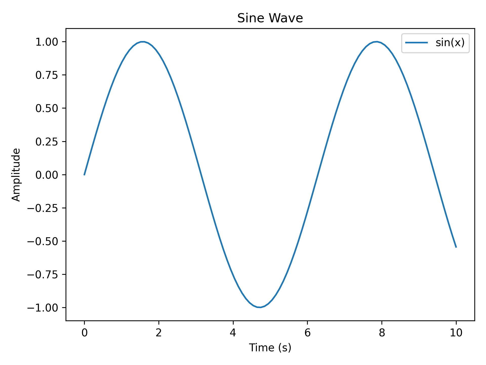
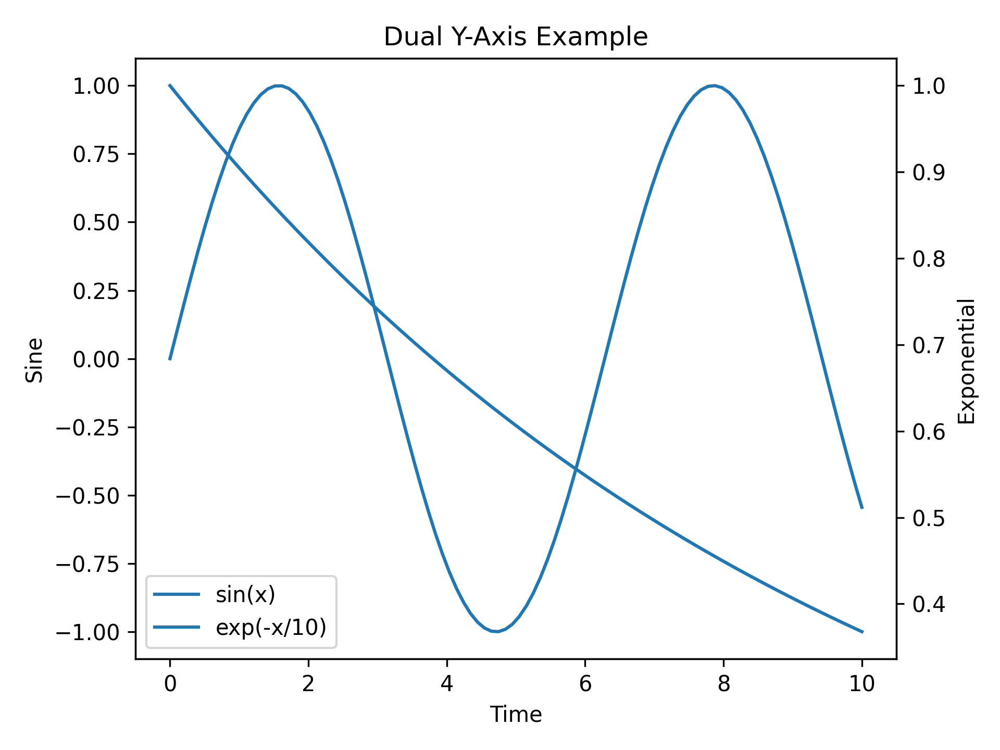
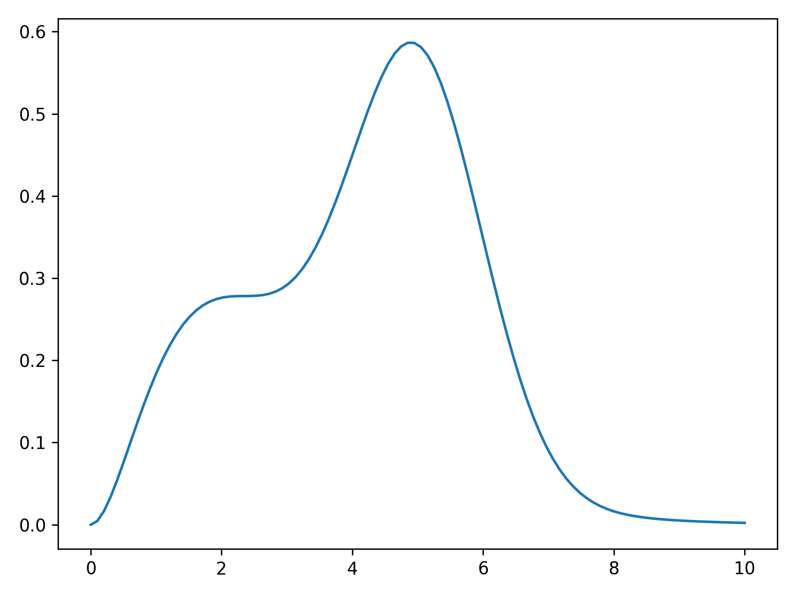
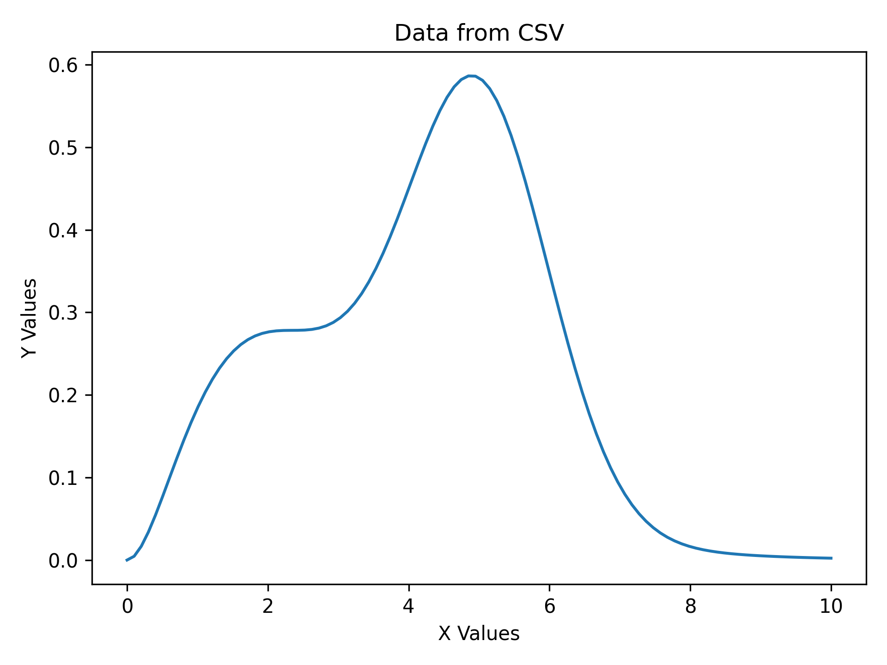
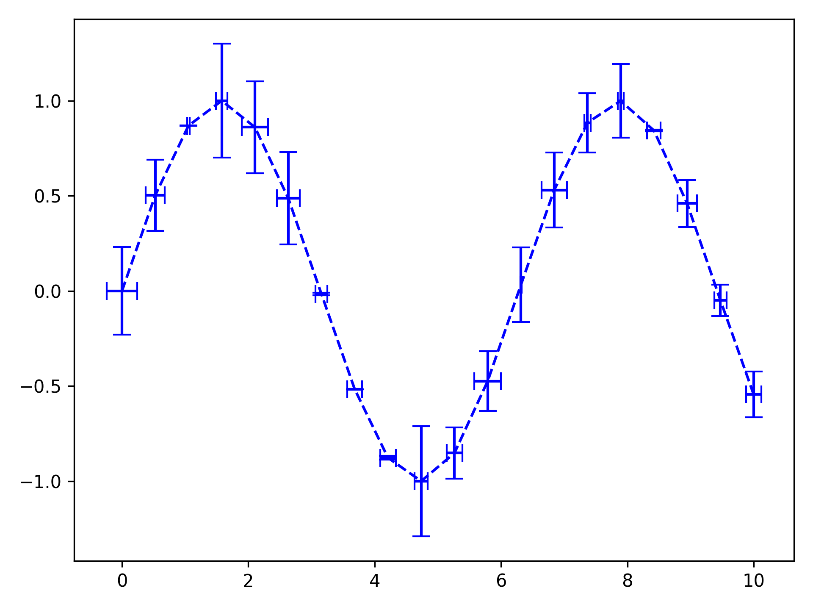
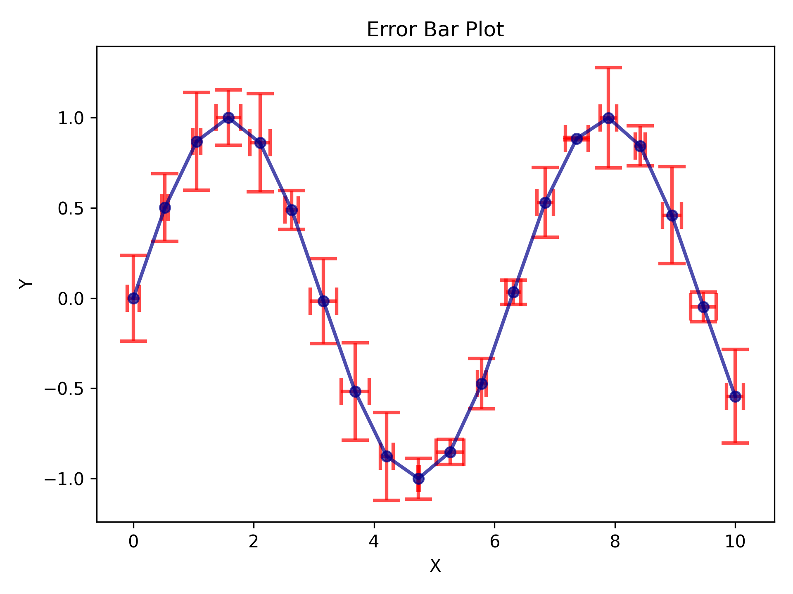
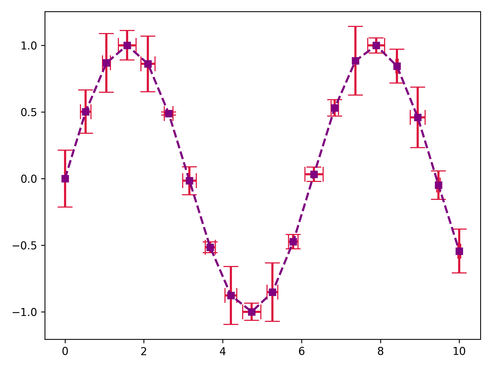
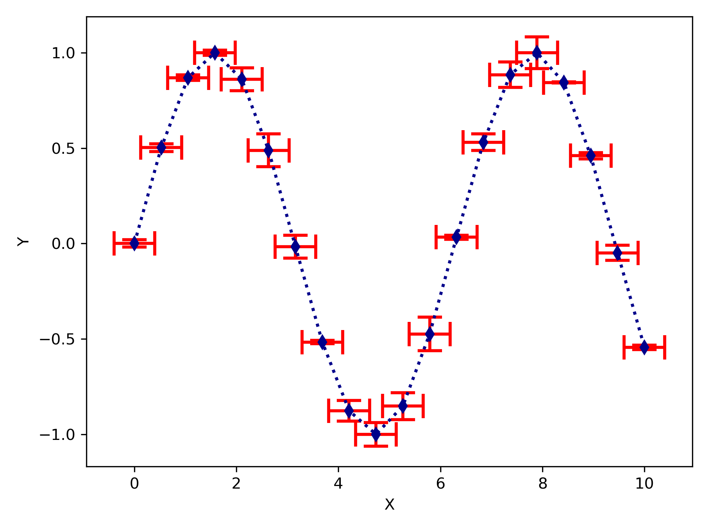

Quick Start Guide
=================

This guide introduces the basic usage of PlotEZ with practical examples.

Basic Plotting
--------------

Simple X vs Y Plot
~~~~~~~~~~~~~~~~~~

The simplest way to create a plot:

.. include:: ../examples/README_example1.py
   :code: python
   :start-line: 3
   :end-line: 13

.. image:: ../examples/images/README_example1.png

With Custom Labels
~~~~~~~~~~~~~~~~~~

.. include:: ../examples/README_example1A.py
   :code: python
   :start-line: 3
   :end-line: 18

Dual-Axis Plots
---------------

Dual Y-Axis
~~~~~~~~~~~

.. include:: ../examples/README_example2.py
   :code: python
   :start-line: 3
   :end-line: 21

Dual X-Axis
~~~~~~~~~~~

Use ``plot_with_dual_axes`` directly for dual x-axis plots:

.. code-block:: python

   from plotez import plot_with_dual_axes

   x1 = np.linspace(0, 10, 100)
   x2 = np.linspace(0, 20, 100)
   y = np.sin(x1)

   plot_with_dual_axes(
       x1, y,
       x2_data=x2,
       use_twin_x=False,
       auto_label=True
   )

Multi-Panel Plots
-----------------

Two Subplots
~~~~~~~~~~~~

Create horizontal or vertical subplot arrangements:

.. code-block:: python

   from plotez import two_subplots

   x1 = np.linspace(0, 10, 100)
   x2 = np.linspace(0, 5, 50)
   y1 = np.sin(x1)
   y2 = np.cos(x2)

   # Horizontal layout
   fig, axs = two_subplots(
       [x1, x2], [y1, y2],
       orientation='h',
       auto_label=True
   )

   # Vertical layout
   fig, axs = two_subplots(
       [x1, x2], [y1, y2],
       orientation='v',
       plot_title='Two Subplots Example'
   )

N×M Grid
~~~~~~~~

Create arbitrary grid layouts:

.. code-block:: python

   from plotez import n_plotter

   # Create 2×2 grid
   x_data = [np.linspace(0, 10, 100) for _ in range(4)]
   y_data = [
       np.sin(x_data[0]),
       np.cos(x_data[1]),
       np.tan(x_data[2] / 5),
       x_data[3]**2 / 100
   ]

   fig, axs = n_plotter(
       x_data, y_data,
       n_rows=2, n_cols=2,
       auto_label=True
   )

Scatter Plots
-------------

Any plot function can create scatter plots:

.. code-block:: python

   from plotez import plot_xy

   x = np.random.randn(100)
   y = np.random.randn(100)

   plot_xy(x, y, is_scatter=True, auto_label=True)

Customization with Parameter Classes
-------------------------------------

Line Plots
~~~~~~~~~~

.. code-block:: python

   from plotez import plot_xy
   from plotez.backend import LinePlotConfig

   x = np.linspace(0, 10, 100)
   y = np.sin(x)

   # Create custom line plot parameters
   line_params = LinePlotConfig(
       linestyle='-',
       linewidth=2,
       color='#FF5733',
       marker='o',
       markersize=4
   )

   plot_xy(x, y, plot_config=line_params)

Scatter Plots
~~~~~~~~~~~~~

.. code-block:: python

   from plotez.backend import ScatterPlotConfig

   scatter_params = ScatterPlotConfig(
       c='blue',
       s=50,
       marker='s',
       alpha=0.6
   )

   plot_xy(x, y, is_scatter=True, plot_config=scatter_params)

Subplot Configuration
~~~~~~~~~~~~~~~~~~~~~

.. code-block:: python

   from plotez.backend import FigureConfig

   subplot_params = FigureConfig(
       sharex=True,
       sharey=True,
       figsize=(12, 8)
   )

   fig, axs = two_subplots(
       [x, x], [y, y*2],
       orientation='h',
       figure_config=subplot_params
   )

Plotting from Files
-------------------

PlotEZ can directly plot two-column CSV files:

.. code-block:: python

    import matplotlib.pyplot as plt
    from plotez import plot_two_column_file

    plot_two_column_file("data.csv")

We can also add some customization to the function

.. code-block:: python

    import matplotlib.pyplot as plt
    from plotez import plot_two_column_file as ptcf

    ptcf("data.csv", delimiter=",", skip_header=True,
         x_label="X Values", y_label="Y Values", plot_title="Data from CSV")

Error Bar Plots
---------------

PlotEZ provides comprehensive error bar plotting capabilities through the ``ErrorPlotConfig`` class
and the ``plot_errorbar`` function.

Basic Error Bars
~~~~~~~~~~~~~~~~

.. include:: ../examples/QUICKSTART_basic_errorbar.py
   :code: python
   :start-line: 3
   :end-line: 22

Enhanced Error Bar Styling
~~~~~~~~~~~~~~~~~~~~~~~~~~

ErrorPlotConfig provides access to all line styling options plus specialized error bar parameters:

.. include:: ../examples/QUICKSTART_style_errorbar.py
   :code: python
   :start-line: 3
   :end-line: 37

Creating ErrorPlotConfig from Dictionary
~~~~~~~~~~~~~~~~~~~~~~~~~~~~~~~~~~~~~~~~~

Use the ``populate()`` class method to create ErrorPlotConfig instances from parameter dictionaries:

.. include:: ../examples/QUICKSTART_epc_from_dict.py
   :code: python
   :start-line: 3
   :end-line: 33

Error Band Plots
----------------

PlotEZ also supports shaded error band plots through the ``ErrorBandConfig`` class
and the ``plot_errorband`` function.

.. include:: ../examples/README_example5.py
   :code: python
   :start-line: 3
   :end-line: 27

Convenience / Wrapper Functions
--------------------------------

PlotEZ ships factory functions that let you build config objects using short, familiar matplotlib
keyword aliases without importing the dataclass names. They live at the top-level ``plotez``
namespace, so a single import covers everything.

**Without wrappers** (explicit dataclass):

.. code-block:: python

   from plotez import plot_errorbar
   from plotez import ErrorPlotConfig

   ep = ErrorPlotConfig(
       color='darkblue',
       linestyle=':',
       linewidth=2,
       marker='d',
       markersize=6,
       capsize=8,
       elinewidth=2,
       ecolor='red',
   )

**With wrappers** (``epc`` short alias, same result):

.. code-block:: python

   from plotez import plot_errorbar, epc

   ep = epc(c='darkblue', ls=':', lw=2, marker='d', ms=6,
            capsize=8, elinewidth=2, ecolor='red')

The same pattern applies to all other config types:

.. code-block:: python

   from plotez import lpc, fgc, ebc, spc

   # Line config
   line = lpc(c='steelblue', lw=2, ls='--', marker='o', ms=4)

   # Figure / subplot layout
   layout = fgc(figsize=(10, 4), sharex=True)

   # Error band
   band = ebc(c='cyan', alpha=0.3, ec='k', ls='--', hatch='/')

   # Scatter
   dots = spc(c='orange', s=40, alpha=0.7, marker='^')

See the :doc:`api` page for the full parameter lists and the
:ref:`Shorthand Key Reference <shorthand-key-reference>` table.

Next Steps
----------

* Explore the :doc:`api` for complete function signatures
* Check out the :doc:`CHANGELOG` for version history
* Review the test suite for more usage examples
