Quick Start Guide
=================

This guide walks through ``plotez`` from the simplest possible plot up to real-world workflows.
Every example corresponds to a runnable script in the ``examples/`` directory.

.. contents:: Sections
   :local:
   :depth: 1

----

Basic Plotting
--------------

Minimal Example
~~~~~~~~~~~~~~~

The absolute minimum code to produce a labeled plot. ``auto_label=True`` generates
``"X"``, ``"Y"``, and ``"Plot"`` as axis and title labels automatically.

.. literalinclude:: ../examples/RTD_E1_simple.py
   :language: python
   :lines: 3-11

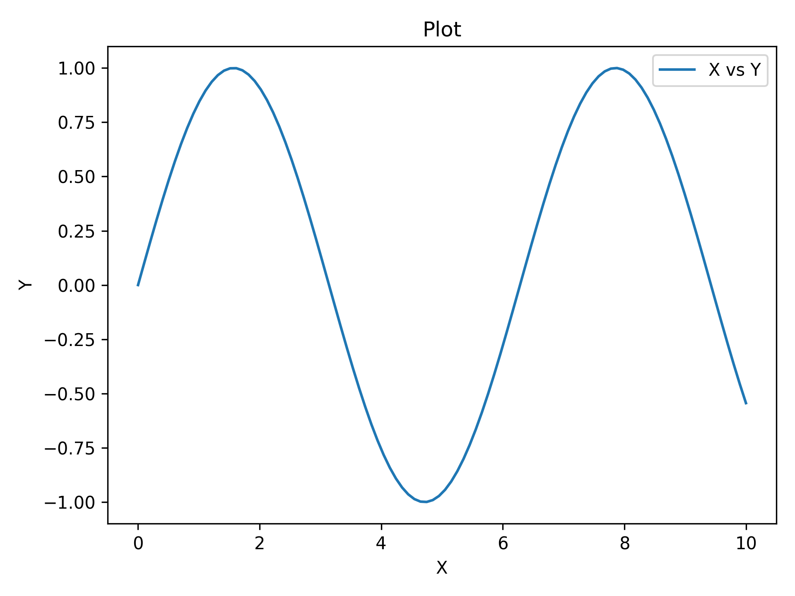

----

Custom Labels
~~~~~~~~~~~~~

Replace auto-generated labels with meaningful scientific ones. ``data_label`` appears
in the legend; all label strings support LaTeX notation (e.g. ``r'$\sin(x)$'``).

.. literalinclude:: ../examples/RTD_E2_custom_labels.py
   :language: python
   :lines: 3-12

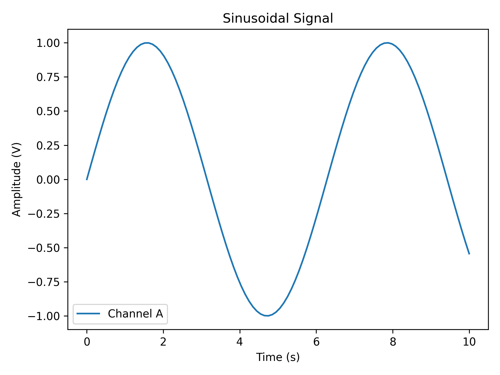

----

Scatter Plot
~~~~~~~~~~~~

Pass ``is_scatter=True`` to switch from a line to a scatter plot — same function,
same parameters, one flag.

.. literalinclude:: ../examples/RTD_E3_scatter_plot.py
   :language: python
   :lines: 3-13

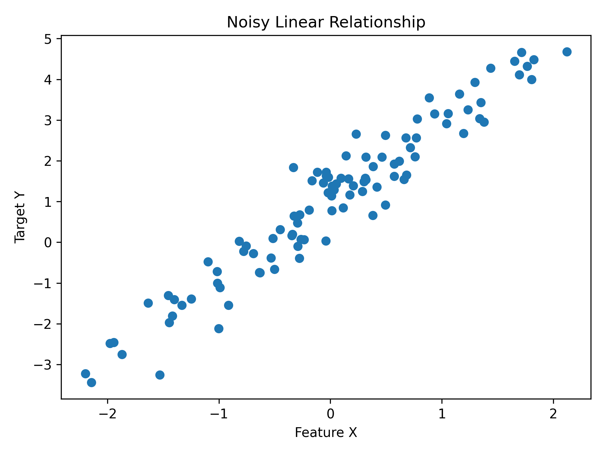

----

Error Visualization
-------------------

Basic Error Bars
~~~~~~~~~~~~~~~~

``y_err`` (and ``x_err``) can be a scalar (same error everywhere) or an array
(per-point errors). Caps are shown by default and controlled via ``capsize``.

.. literalinclude:: ../examples/RTD_E4_errorbar.py
   :language: python
   :lines: 3-15

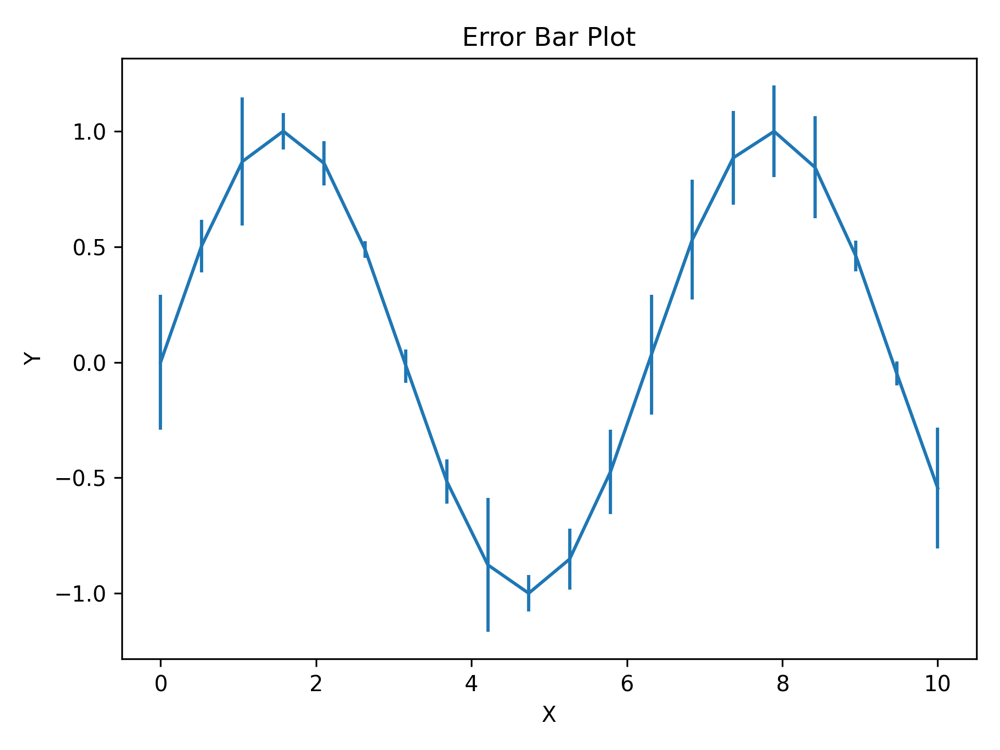

----

Styled Error Bars
~~~~~~~~~~~~~~~~~

``ErrorPlotConfig`` exposes every line styling option plus specialized error bar
parameters. ``ecolor`` sets the error bar colour independently from the line colour;
``elinewidth`` sets the error bar line thickness.

.. literalinclude:: ../examples/RTD_E5_errorbar_customized.py
   :language: python
   :lines: 3-24

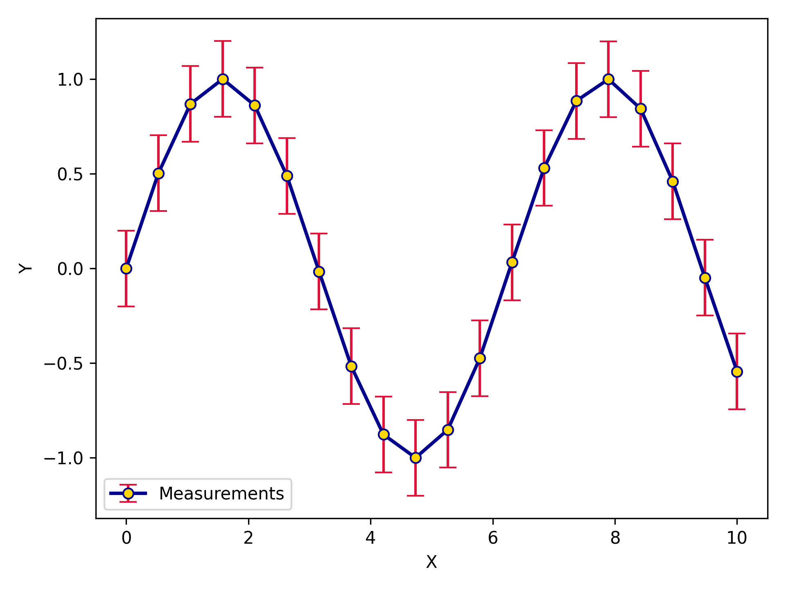

----

Asymmetric Errors
~~~~~~~~~~~~~~~~~

Pass a ``(2, N)`` array to ``y_err`` (or ``x_err``) for different lower and upper
uncertainties — first row is lower errors, second row is upper errors.

.. literalinclude:: ../examples/RTD_E6_asym_errors.py
   :language: python
   :lines: 3-14

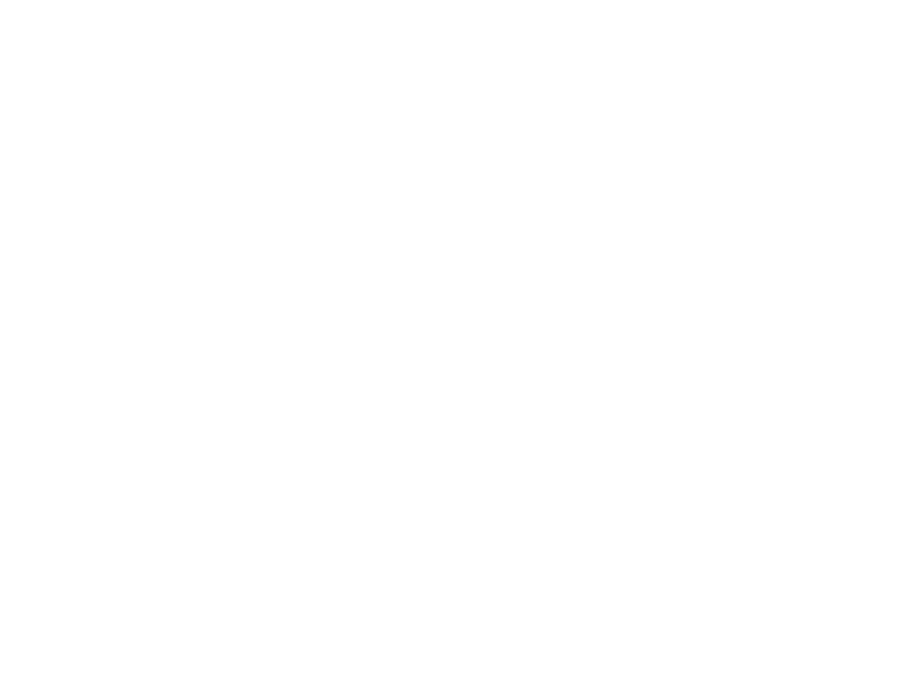

----

Error Bands
~~~~~~~~~~~

For dense, continuous data shaded bands are cleaner than individual error bars.
``y_lower`` and ``y_upper`` are absolute values (not offsets); ``band_config``
controls the fill and ``line_config`` controls the central line.

.. literalinclude:: ../examples/RTD_E7_errorbands.py
   :language: python
   :lines: 3-26

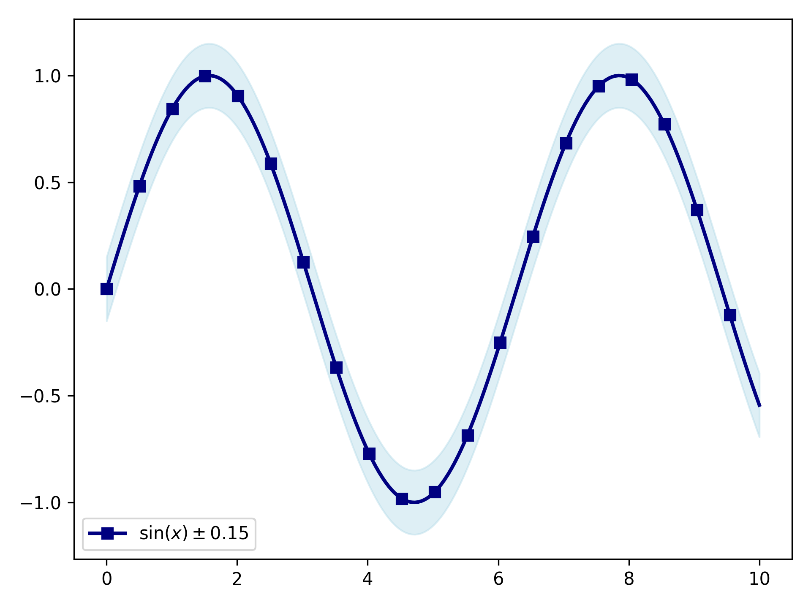

----

Multi-Panel Layouts
-------------------

Two Subplots
~~~~~~~~~~~~

``two_subplots`` wraps ``n_plotter`` for the common two-panel case.
Use ``orientation='h'`` for side-by-side or ``'v'`` for stacked; ``subplot_title``
labels each panel individually.

.. literalinclude:: ../examples/RTD_E8_two_subplots.py
   :language: python
   :lines: 3-19

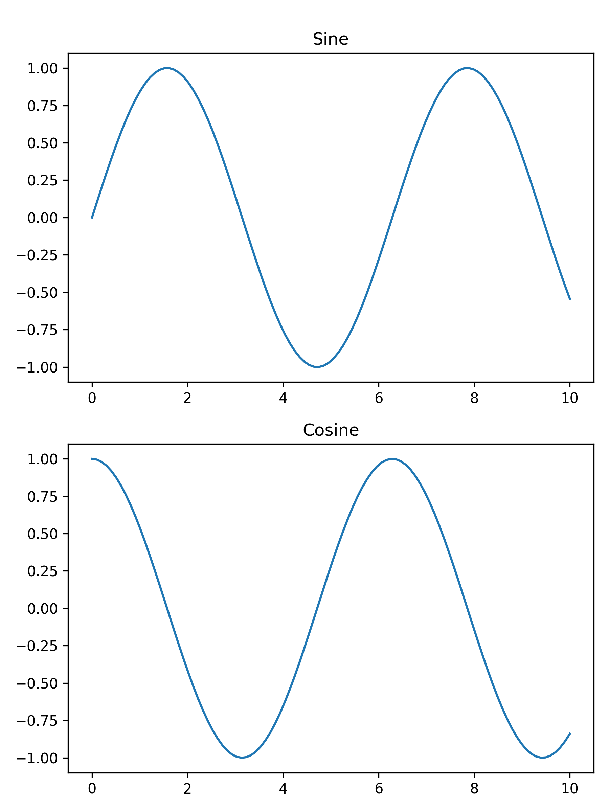

----

Grid of Four
~~~~~~~~~~~~

``n_plotter`` handles arbitrary N×M grids. Config parameters passed as lists
apply per-subplot, cycling if the list is shorter than the panel count.

.. literalinclude:: ../examples/RTD_E9_grid_of_four.py
   :language: python
   :lines: 3-22

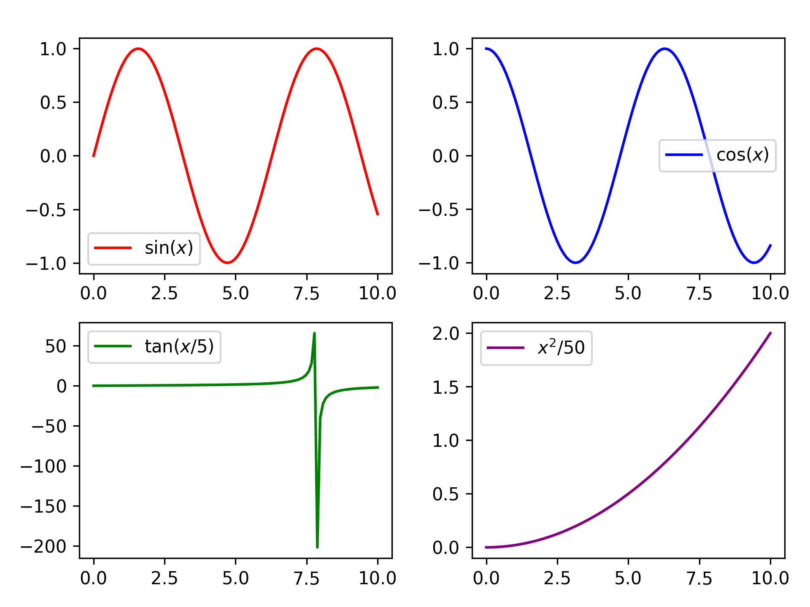

----

Shared Axes
~~~~~~~~~~~

Pass a ``FigureConfig`` with ``sharex=True`` / ``sharey=True`` to lock axis
ranges across all panels — redundant tick labels are hidden automatically.

.. literalinclude:: ../examples/RTD_E10_shared_axes.py
   :language: python
   :lines: 3-18

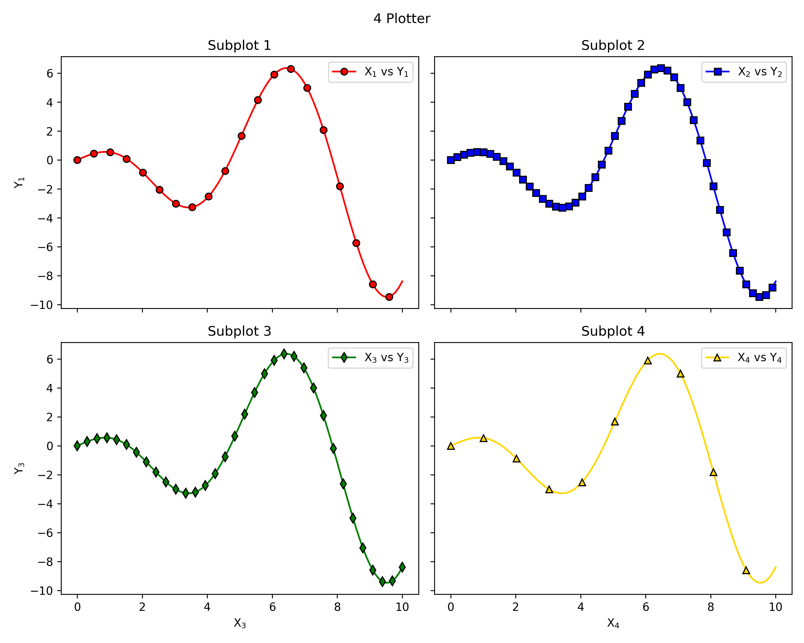

----

Customization
-------------

Config Classes
~~~~~~~~~~~~~~

``LinePlotConfig`` (and its siblings ``ErrorPlotConfig``, ``ErrorBandConfig``,
``ScatterPlotConfig``, ``FigureConfig``) give full IDE autocomplete and are
reusable across multiple plots. Any matplotlib parameter not covered by a
named field can be forwarded via the ``_extra`` dict.

.. literalinclude:: ../examples/RTD_E5_errorbar_customized.py
   :language: python
   :lines: 3-24

----

Shorthand Helpers
~~~~~~~~~~~~~~~~~

``lpc``, ``epc``, ``ebc``, ``spc``, and ``fgc`` are factory functions that accept
familiar matplotlib aliases (``c``, ``lw``, ``ls``, ``ms``, ``mec``, ``mfc``) and
return the corresponding config object — no class import required.

.. code-block:: python

   from plotez import lpc, epc, ebc, spc, fgc

   line   = lpc(c='steelblue', lw=2, ls='--', marker='o', ms=4)
   ep     = epc(c='darkblue', ls=':', lw=2, marker='d', ms=6,
                capsize=8, elinewidth=2, ecolor='red')
   band   = ebc(c='cyan', alpha=0.3, ec='k', ls='--', hatch='/')
   dots   = spc(c='orange', s=40, alpha=0.7, marker='^')
   layout = fgc(figsize=(10, 4), sharex=True)

See the :doc:`api` page for the full shorthand key reference.

----

Real-World Workflows
--------------------

Plotting from CSV Files
~~~~~~~~~~~~~~~~~~~~~~~

``plot_two_column_file`` reads any two-column delimited file directly —
no pandas boilerplate. The file must have exactly two columns (x, y);
use ``skip_header=True`` to ignore a header row.

.. literalinclude:: ../examples/RTD_E11_from_files.py
   :language: python
   :lines: 3-17

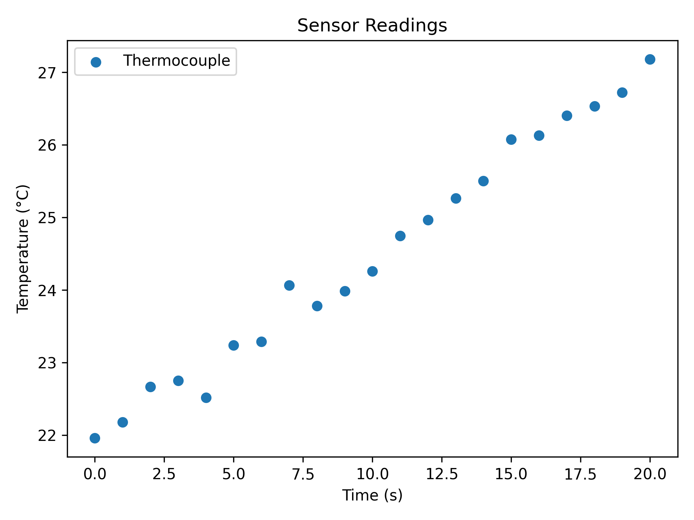

----

Mixing with Matplotlib
~~~~~~~~~~~~~~~~~~~~~~

All ``plotez`` functions accept an ``axis`` keyword so you can drop them
into any existing matplotlib figure. They return the ``Axes`` object for
further customisation.

.. literalinclude:: ../examples/RTD_E12_matplotlib_integration.py
   :language: python
   :lines: 3-20

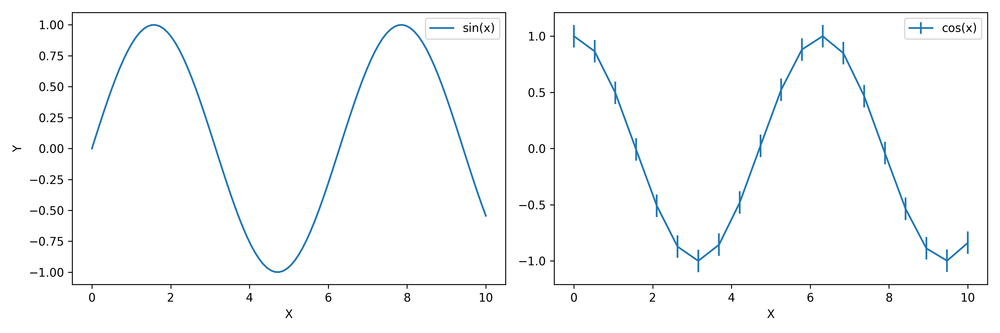

----

Next Steps
----------

* See :doc:`api` for complete function and config-class signatures.
* Check :doc:`CHANGELOG` for version history.
* Browse the ``examples/`` directory for all runnable scripts.
