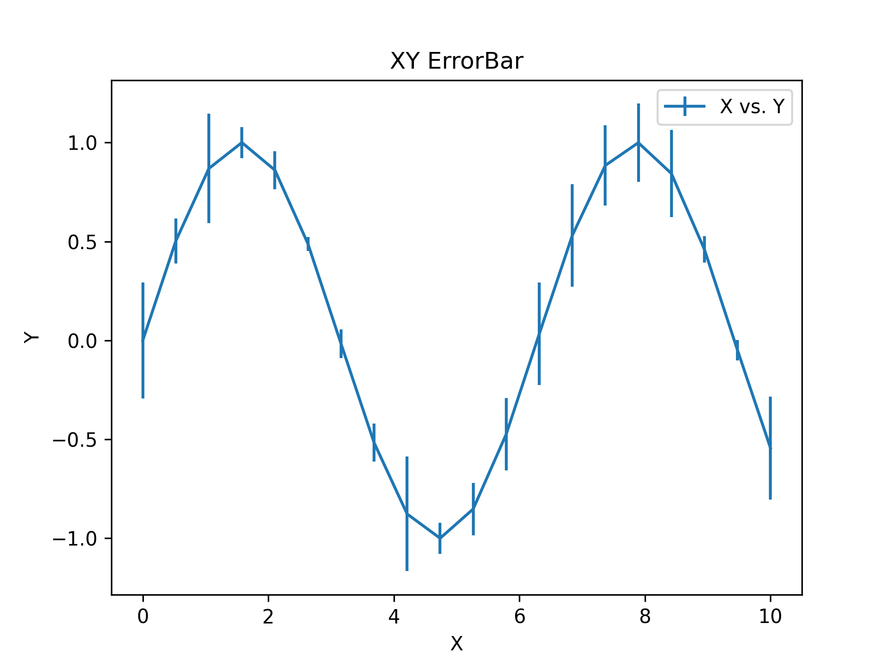
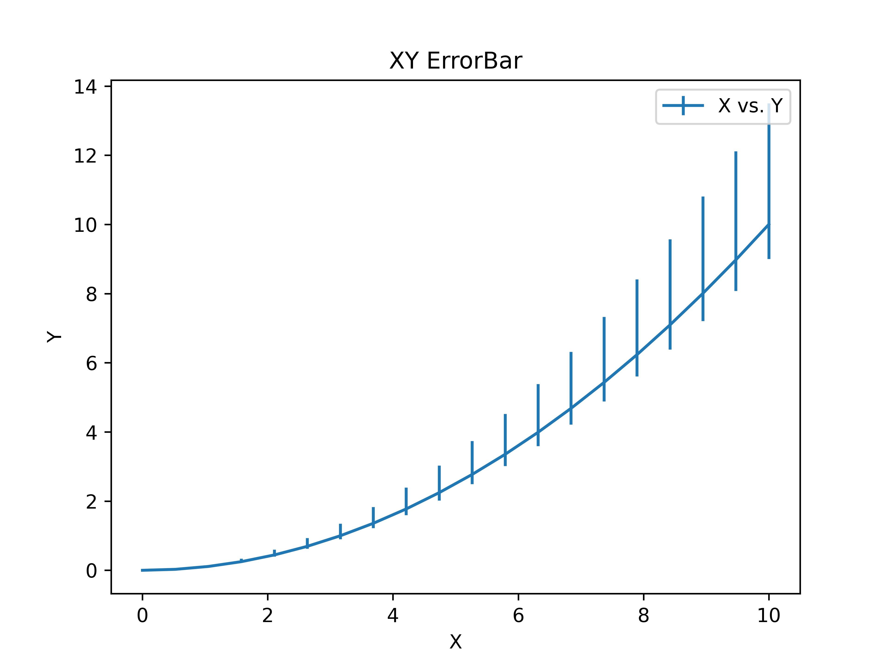
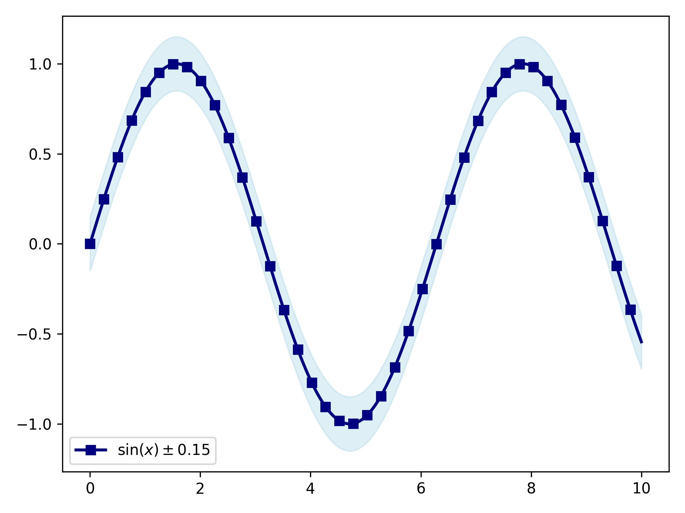
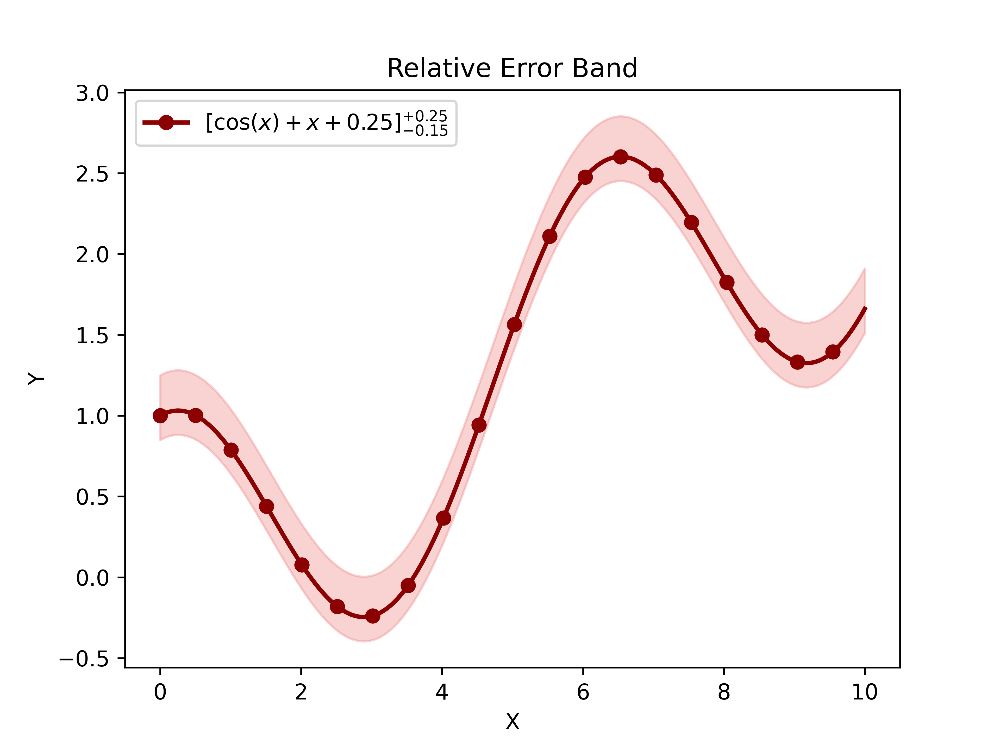
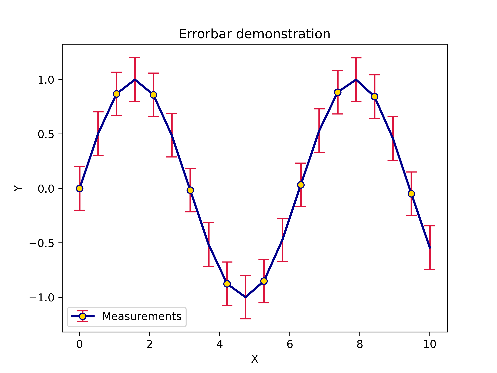

Quick Start Guide
=================

This guide walks through ``plotez`` from the simplest possible plot up to real-world workflows.
Every example corresponds to a runnable script in the ``examples/`` directory.

.. contents:: Sections
   :local:
   :depth: 1

----

Basic Plotting
--------------

Minimal Example
~~~~~~~~~~~~~~~

The absolute minimum code to produce a labeled plot. Pass ``x_label``, ``y_label``,
and ``plot_title`` for axis and title labels.

.. literalinclude:: ../examples/rtd_images/RTD_E1_simple.py
   :language: python
   :lines: 3-11

.. image:: ../examples/rtd_images/RTD_E1_simple.png

----

Custom Labels
~~~~~~~~~~~~~

Replace auto-generated labels with meaningful scientific ones. ``data_label`` appears
in the legend; all label strings support LaTeX notation (e.g. ``r'$\sin(x)$'``).

.. literalinclude:: ../examples/rtd_images/RTD_E2_custom_labels.py
   :language: python
   :lines: 3-18

.. image:: ../examples/rtd_images/RTD_E2_custom_labels.png

----

Scatter Plot
~~~~~~~~~~~~

Pass ``is_scatter=True`` to switch from a line to a scatter plot — same function,
same parameters, one flag.

.. literalinclude:: ../examples/rtd_images/RTD_E3_scatter_plot.py
   :language: python
   :lines: 3-13

.. image:: ../examples/rtd_images/RTD_E3_scatter_plot.png

----

Error Visualization
-------------------

Basic Error Bars
~~~~~~~~~~~~~~~~

``y_err`` (and ``x_err``) can be a scalar (same error everywhere) or an array
(per-point errors). Caps are shown by default and controlled via ``capsize``.

.. literalinclude:: ../examples/rtd_images/RTD_E4_errorbar.py
   :language: python
   :lines: 3-15

----

Styled Error Bars
~~~~~~~~~~~~~~~~~

``ErrorPlotConfig`` exposes every line styling option plus specialized error bar
parameters. ``ecolor`` sets the error bar colour independently from the line colour;
``elinewidth`` sets the error bar line thickness.

.. literalinclude:: ../examples/rtd_images/RTD_E5_errorbar_customized.py
   :language: python
   :lines: 3-32

----

Asymmetric Errors
~~~~~~~~~~~~~~~~~

Pass a ``(2, N)`` array to ``y_err`` (or ``x_err``) for different lower and upper
uncertainties — first row is lower errors, second row is upper errors.

.. literalinclude:: ../examples/rtd_images/RTD_E6_asym_errors.py
   :language: python
   :lines: 3-14

----

Error Bands
~~~~~~~~~~~

For dense, continuous data shaded bands are cleaner than individual error bars.
``y_lower`` and ``y_upper`` are absolute values (not offsets); ``band_config``
controls the fill and ``line_config`` controls the central line.

.. literalinclude:: ../examples/rtd_images/RTD_E7_errorbands.py
   :language: python
   :lines: 3-26

----

Relative Error Band
~~~~~~~~~~~~~~~~~~~

``plot_errorband_relative`` is a convenience wrapper around ``plot_errorband`` where
``y_lower`` and ``y_upper`` are offsets from ``y_data`` rather than absolute bounds —
so you can pass a single uncertainty value and let plotEZ compute the band edges.

.. literalinclude:: ../examples/rtd_images/RTD_E15_errorband_relative.py
   :language: python
   :lines: 3-25

----

Multi-Panel Layouts
-------------------

.. note::

   Neither ``two_subplots`` nor ``n_plotter`` calls ``tight_layout`` internally.
   Call ``axs.flat[0].get_figure().tight_layout()`` (or ``plt.tight_layout()``)
   yourself after plotting if you want tighter spacing.

Two Subplots
~~~~~~~~~~~~

``two_subplots`` wraps ``n_plotter`` for the common two-panel case.
Use ``orientation='h'`` for side-by-side or ``'v'`` for stacked; ``subplot_titles``
labels each panel individually.
Returns a shaped ``(1, 2)`` (horizontal) or ``(2, 1)`` (vertical) ``ndarray`` of
``Axes``; access panels as ``axs[0, 0]`` / ``axs[0, 1]`` or use ``axs.flat[i]``.

.. literalinclude:: ../examples/rtd_images/RTD_E8_two_subplots.py
   :language: python
   :lines: 3-20

.. image:: ../examples/rtd_images/RTD_E8_two_subplots.png

----

Grid of Four
~~~~~~~~~~~~

``n_plotter`` handles arbitrary N×M grids. Config parameters passed as lists
apply per-subplot, cycling if the list is shorter than the panel count.
The function returns a shaped ``(n_rows, n_cols)`` ``ndarray`` of ``Axes``; use
``axs.flat[i]`` for linear indexing or ``axs[row, col]`` for 2-D access.
The parent figure is available via ``axs.flat[0].get_figure()``.

.. literalinclude:: ../examples/rtd_images/RTD_E9_grid_of_four.py
   :language: python
   :lines: 3-22

.. image:: ../examples/rtd_images/RTD_E9_grid_of_four.png

----

Shared Axes
~~~~~~~~~~~

Pass ``figure_kwargs={"sharex": True, "sharey": True}`` to lock axis
ranges across all panels — redundant tick labels are hidden automatically.

.. literalinclude:: ../examples/rtd_images/RTD_E10_shared_axes.py
   :language: python
   :lines: 3-29

.. image:: ../examples/rtd_images/RTD_E10_shared_axes.png

----

Customization
-------------

Config Classes
~~~~~~~~~~~~~~

``LinePlotConfig`` (and its siblings ``ErrorPlotConfig``, ``ErrorBandConfig``,
``ScatterPlotConfig``) give full IDE autocomplete and are
reusable across multiple plots. Any matplotlib parameter not covered by a
named field can be forwarded via the ``_extra`` dict.

.. literalinclude:: ../examples/rtd_images/RTD_E5-2_errorbar_customized.py
   :language: python
   :lines: 3-33

----

Shorthand Helpers
-----------------

``lpc``, ``epc``, ``ebc``, ``spc``, and ``hgc`` are factory functions that accept
familiar matplotlib aliases (``c``, ``lw``, ``ls``, ``ms``, ``mec``, ``mfc``) and
return the corresponding config object — no class import required.

.. code-block:: python

   from plotez import lpc, epc, ebc, spc, hgc

   line = lpc(c='steelblue', lw=2, ls='--', marker='o', ms=4)
   ep = epc(c='darkblue', ls=':', lw=2, marker='d', ms=6, capsize=8, elinewidth=2, ecolor='red')
   band = ebc(c='cyan', alpha=0.3, ec='k', ls='--', hatch='/')
   dots = spc(c='orange', s=40, alpha=0.7, marker='^')
   hist = hgc(bins=40, c='steelblue', ec='white', alpha=0.8)

See the :doc:`api` page for the full shorthand key reference.

----

Error Handling
--------------

PlotEZ provides domain-specific exceptions for clear, catchable error handling. All exceptions
are available from ``plotez.backend.error_handling``.

Exception Hierarchy
~~~~~~~~~~~~~~~~~~~

.. code-block:: python

   from plotez.backend.error_handling import (
       PlotError,           # Base for all plotting errors
       DataError,           # Base for data-related errors
       ConfigurationError,  # Base for config/parameter errors

       # Data errors
       ShapeError,          # Invalid array shape (e.g., bad error array)
       EmptyDataError,      # Empty required data
       ColumnCountError,    # File doesn't have 2 columns

       # Configuration errors
       OrientationError,    # Invalid plot orientation
       AxisLabelError,      # axis_labels has wrong length
       TwinXDataError,      # x2_data given with use_twin_x=True
       TwinYDataError,      # y2_data given with use_twin_x=False
   )

Catching Specific Exceptions
~~~~~~~~~~~~~~~~~~~~~~~~~~~~~

Catch specific errors for precise error handling:

.. code-block:: python

   import numpy as np
   from plotez import plot_errorbar
   from plotez.backend.error_handling import ShapeError

   x = np.array([1, 2, 3])
   y = np.array([1, 2, 3])
   bad_err = np.array([[1, 2, 3], [4, 5, 6], [7, 8, 9]])  # Wrong shape!

   try:
       plot_errorbar(x, y, x_err=bad_err)
   except ShapeError as e:
       print(f"Invalid error array: {e}")

Catching by Base Class
~~~~~~~~~~~~~~~~~~~~~~

Use base classes to catch multiple related errors:

.. code-block:: python

   from plotez import plot_with_dual_axes
   from plotez.backend.error_handling import DataError, ConfigurationError

   try:
       # Your plotting code here
       plot_with_dual_axes([], [1, 2, 3],
                          axis_labels=("X", "Y", ""))
   except DataError:
       print("Data-related error occurred")
   except ConfigurationError:
       print("Configuration error occurred")

Mutable-Argument Deprecation Warning
~~~~~~~~~~~~~~~~~~~~~~~~~~~~~~~~~~~~~

Several label parameters (``data_labels``, ``x_labels``, ``y_labels``, ``subplot_titles``,
``axis_labels``) previously accepted mutable ``list`` defaults. Passing a plain ``list``
for these arguments now emits a ``DeprecationWarning``; prefer an immutable ``tuple``:

.. code-block:: python

   from plotez import two_subplots

   axs = two_subplots(x_list, y_list,
                      x_labels=("Time (s)", "Time (s)"),   # tuple — no warning
                      y_labels=("Amplitude", "Phase"))

----

Histogram & Density
-------------------

Histogram
~~~~~~~~~

``plot_hist`` wraps ``ax.hist`` with the same consistent config-object pattern used
throughout plotEZ. ``hgc`` (short for ``histogram_config``) is the companion factory
function — pass familiar histogram parameters as keyword arguments and get a
``HistogramConfig`` back.

.. literalinclude:: ../examples/rtd_images/RTD_E13_histogram.py
   :language: python
   :lines: 3-21

.. image:: ../examples/rtd_images/RTD_E13_histogram.png

----

Density Plot
~~~~~~~~~~~~

``plot_density`` is a thin wrapper around ``plot_hist`` that automatically sets
``density=True`` — the y-axis shows probability density instead of raw counts.
Pass a ``HistogramConfig`` (or ``hgc``) as usual; ``density`` will be enforced
regardless of the config value.

.. literalinclude:: ../examples/rtd_images/RTD_E14_density.py
   :language: python
   :lines: 3-21

.. image:: ../examples/rtd_images/RTD_E14_density.png

----

Real-World Workflows
--------------------

Plotting from CSV Files
~~~~~~~~~~~~~~~~~~~~~~~

``plot_two_column_file`` reads any two-column delimited file directly —
no pandas boilerplate. The file must have exactly two columns (x, y);
use ``skip_header=True`` to ignore a header row.

.. literalinclude:: ../examples/rtd_images/RTD_E11_from_files.py
   :language: python
   :lines: 3-17

.. image:: ../examples/rtd_images/RTD_E11_from_files.png

----

Mixing with Matplotlib
~~~~~~~~~~~~~~~~~~~~~~

All ``plotez`` functions accept an ``axis`` keyword so you can drop them
into any existing matplotlib figure. Return types are axes-only:

* Single-axis functions → ``Axes``
* Dual-axis functions (``plot_with_dual_axes``, ``plot_xyy``, ``plot_xxy``) → ``tuple[Axes, Axes]``
* Grid functions (``n_plotter``, ``two_subplots``) → shaped ``(n_rows, n_cols)`` ``ndarray`` of ``Axes``

The parent ``Figure`` is always accessible via ``ax.get_figure()``.

.. literalinclude:: ../examples/rtd_images/RTD_E12_matplotlib_integration.py
   :language: python
   :lines: 3-20

.. image:: ../examples/rtd_images/RTD_E12_matplotlib_integration.png

----

Next Steps
----------

* See :doc:`api` for complete function and config-class signatures.
* Check :doc:`CHANGELOG` for version history.
* Browse the ``examples/`` directory for all runnable scripts.
