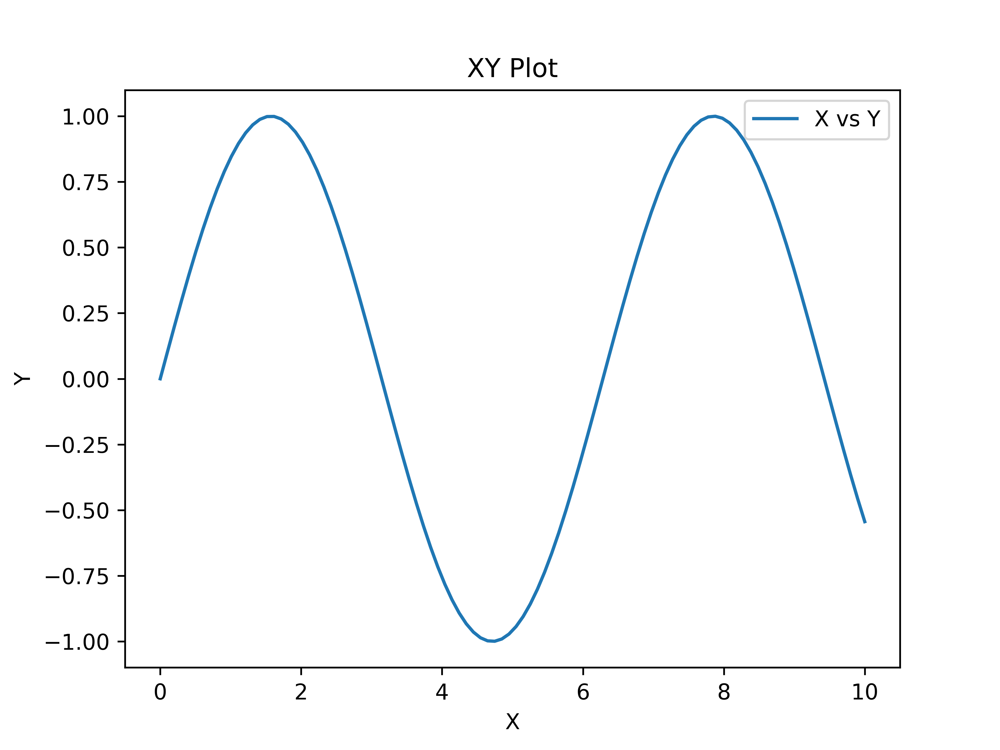
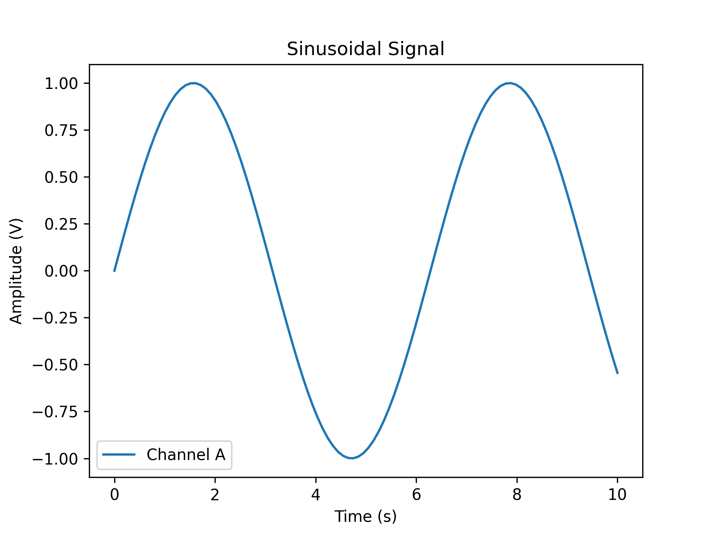
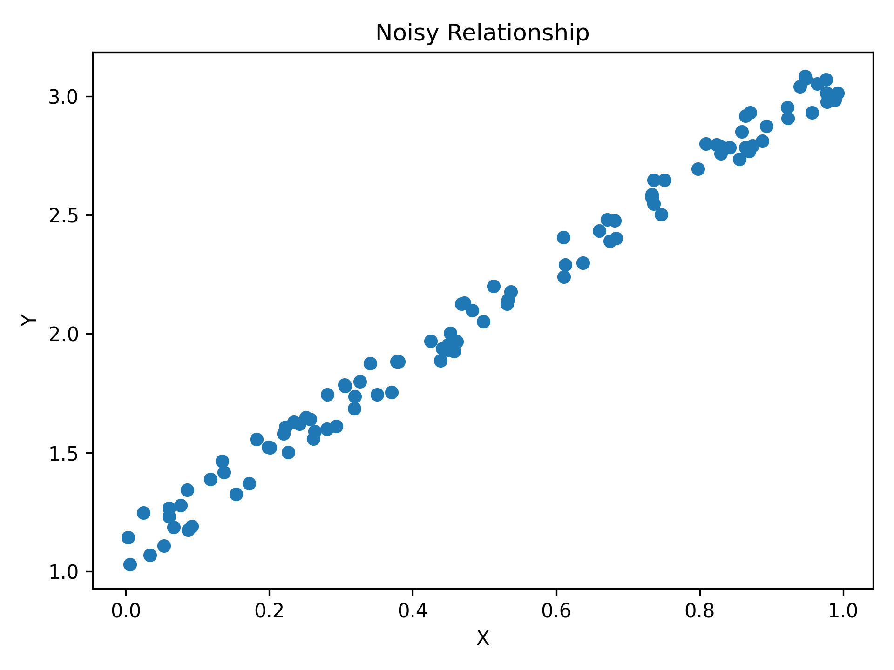

Quick Start Guide
=================

This guide covers the shortest path from installing ``plotez`` to creating line and scatter plots.
Every example corresponds to a runnable script in the ``examples/`` directory.

.. toctree::
   :hidden:
   :maxdepth: 1

   quickstart_child/error_visualization
   quickstart_child/multi_panel_layouts
   quickstart_child/configuration_validation
   quickstart_child/data_workflows

.. contents:: Sections
   :local:
   :depth: 1

----

Minimal Example
---------------

The absolute minimum code to produce a labeled plot.
Pass ``x_label``, ``y_label``, and ``plot_title`` for axis and title labels.

.. literalinclude:: ../examples/rtd_images/RTD_E1_simple.py
   :language: python
   :lines: 3-11

----

Custom Labels
-------------

Replace auto-generated labels with meaningful scientific ones.
``data_label`` appears in the legend; all label strings  support LaTeX notation (e.g. ``r'$\sin(x)$'``).

.. literalinclude:: ../examples/rtd_images/RTD_E2_custom_labels.py
   :language: python
   :lines: 3-18

----

Scatter Plot
------------

Pass ``is_scatter=True`` to switch from a line to a scatter plot: same function, same parameters, one flag.

.. literalinclude:: ../examples/rtd_images/RTD_E3_scatter_plot.py
   :language: python
   :lines: 3-13

----

Continue Learning
-----------------

* :doc:`quickstart_child/error_visualization` covers error bars, asymmetric errors, and error bands.
* :doc:`quickstart_child/multi_panel_layouts` covers two-panel figures, arbitrary grids, shared axes, layout management, and return shapes.
* :doc:`quickstart_child/configuration_validation` covers reusable config objects, shorthand helpers, exceptions, validation, and label collections.
* :doc:`quickstart_child/data_workflows` covers histograms, density plots, two-column files, and integration with existing matplotlib axes.
* :doc:`api` contains complete function signatures and parameter details.
