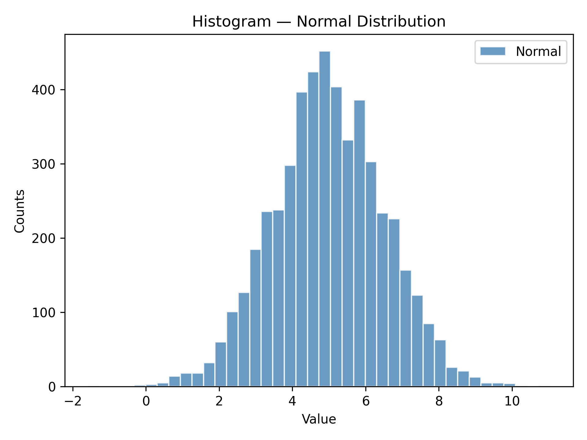
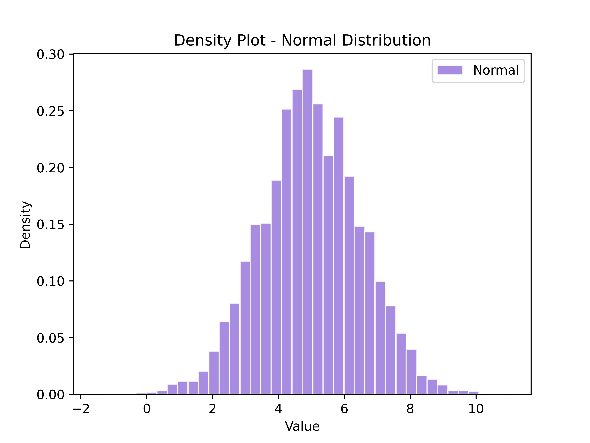
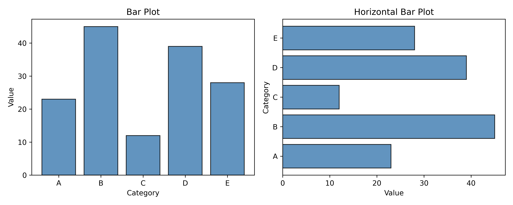
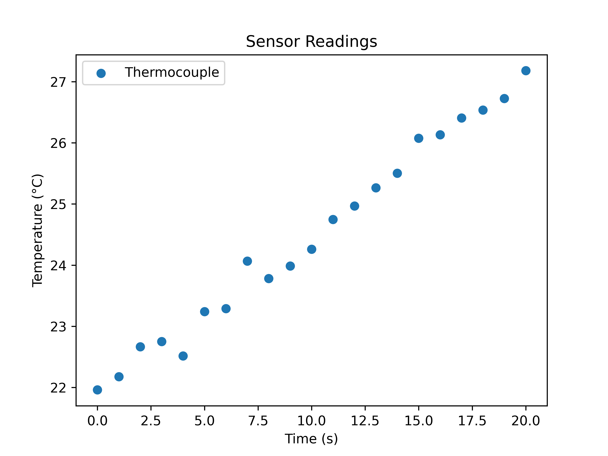
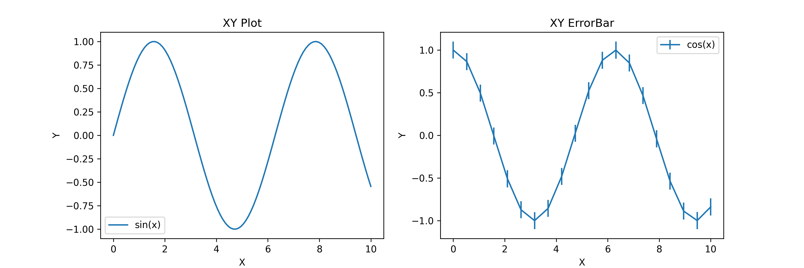

Data Workflows
==============

PlotEZ includes helpers for distributions, delimited files, and integration with figures created directly through matplotlib.
Complete signatures and parameter details are available in :doc:`../api`.

.. contents:: Sections
   :local:
   :depth: 1

----

Histograms
----------

``plot_hist`` wraps ``ax.hist`` with the same config-object pattern used throughout plotEZ. ``hgc``
(short for ``histogram_config``) is the companion factory function: pass familiar histogram parameters as keyword
arguments and get a ``HistogramConfig`` back.
``x_data`` must be one-dimensional; call ``plot_hist`` once per dataset when plotting multiple distributions.

.. literalinclude:: ../../examples/rtd_images/RTD_E13_histogram.py
   :language: python
   :lines: 3-21

----

Density Plots
-------------

``plot_density`` is a thin wrapper around ``plot_hist`` that automatically sets ``density=True`` so the y-axis shows
probability density instead of raw counts.
Pass a ``HistogramConfig`` (or ``hgc``) as usual; ``density`` is enforced regardless of the config value.
The same 1D input requirement applies.

.. literalinclude:: ../../examples/rtd_images/RTD_E14_density.py
   :language: python
   :lines: 3-21

----

Bar Plots
---------

``plot_bar`` and ``plot_barh`` share a common ``BarPlotConfig`` and the same ``_bar_plot`` dispatch internally —
``x_data`` supplies the categories and ``y_data`` the bar lengths either way, ``plot_barh`` just swaps which axis
each maps to. Pass a ``list`` for ``color``, ``edgecolor``, ``linewidth``, ``alpha``, ``width``, or ``hatch`` to
style each bar individually; a scalar applies to every bar.

.. literalinclude:: ../../examples/rtd_images/RTD_E17_bar_plot.py
   :language: python
   :lines: 3-26

----

Plotting Two-Column Files
-------------------------

``plot_two_column_file`` reads any two-column delimited file directly.
The file must contain at least two data rows and exactly two columns (x, y); use ``skip_header=True`` to ignore a header row.
Empty and single-row files raise ``EmptyDataError``.

.. literalinclude:: ../../examples/rtd_images/RTD_E11_from_files.py
   :language: python
   :lines: 3-17

----

Existing Matplotlib Axes
------------------------

All ``plotez`` functions accept an ``axis`` keyword, so they can draw into an existing matplotlib figure.
Return types are axes-only:

* Single-axis functions return ``Axes``.
* Dual-axis functions (``plot_with_dual_axes``, ``plot_xyy``, and ``plot_xxy``)
  return ``tuple[Axes, Axes]``.
* Grid functions (``n_plotter`` and ``two_subplots``) return a shaped
  ``(n_rows, n_cols)`` ``ndarray`` of ``Axes``.

The parent ``Figure`` is always accessible through ``ax.get_figure()``.

.. literalinclude:: ../../examples/rtd_images/RTD_E12_matplotlib_integration.py
   :language: python
   :lines: 3-20

