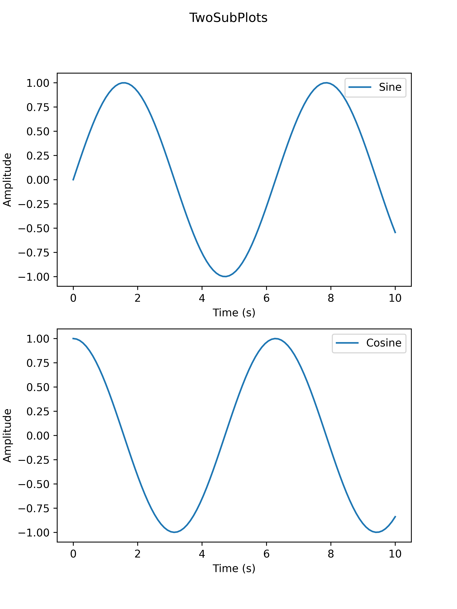
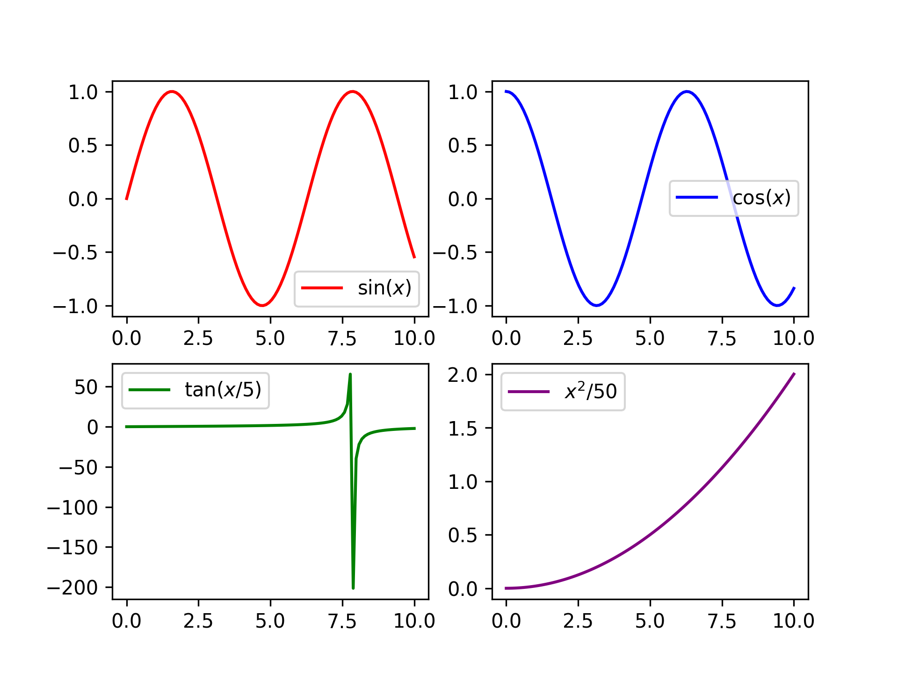
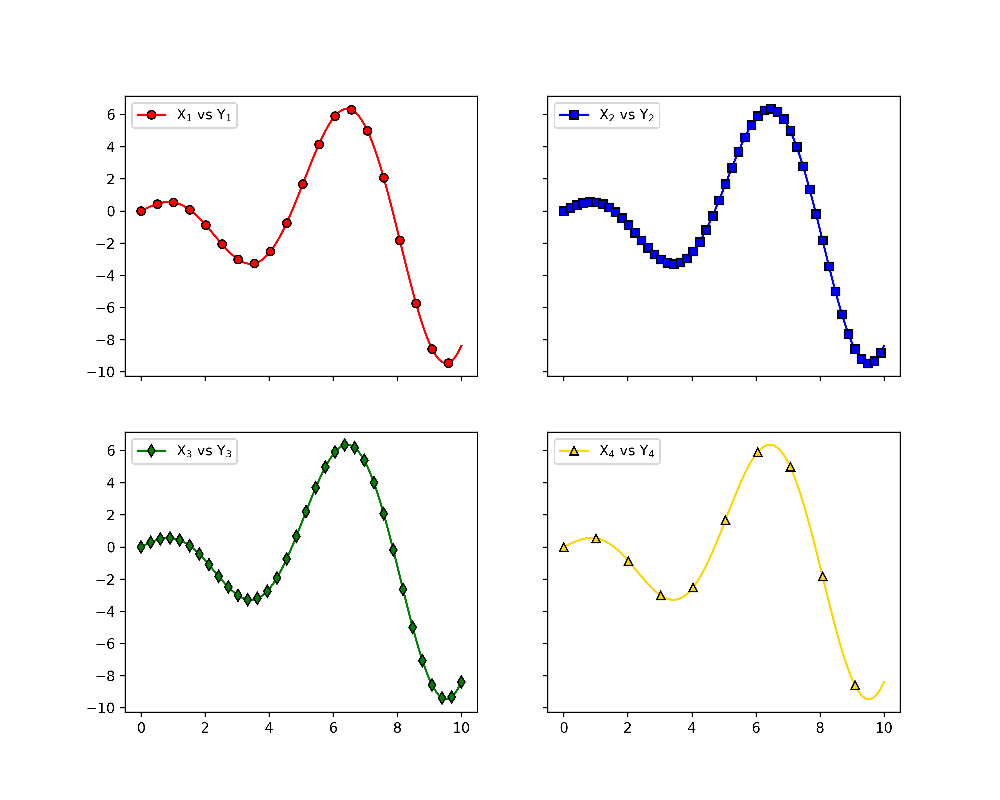

Multi-Panel Layouts
===================

``two_subplots`` handles the common two-panel case, while ``n_plotter`` creates arbitrary grids.
Complete signatures and parameter details are available in :doc:`../api`.

.. contents:: Sections
   :local:
   :depth: 1

----

Layout Management
-----------------

Neither ``two_subplots`` nor ``n_plotter`` calls ``tight_layout`` internally.
Call ``axs.flat[0].get_figure().tight_layout()`` (or ``plt.tight_layout()``) after plotting if you want tighter spacing.

Both functions return a shaped ``(n_rows, n_cols)`` ``ndarray`` of ``Axes``.
Use ``axs[row, col]`` for two-dimensional access or ``axs.flat[i]`` for linear indexing.
The parent figure is available via ``axs.flat[0].get_figure()``.

----

Two Subplots
------------

``two_subplots`` wraps ``n_plotter`` for the common two-panel case.
Use ``orientation='h'`` for side-by-side or ``'v'`` for stacked; ``subplot_titles`` labels each panel individually.
The return shape is ``(1, 2)`` for horizontal layouts and ``(2, 1)`` for vertical layouts.

.. literalinclude:: ../../examples/rtd_images/RTD_E8_two_subplots.py
   :language: python
   :lines: 3-20

----

Arbitrary Grids
---------------

``n_plotter`` handles arbitrary N x M grids. Config parameters passed as lists apply per subplot, cycling if the list is shorter than the panel count.

.. literalinclude:: ../../examples/rtd_images/RTD_E9_grid_of_four.py
   :language: python
   :lines: 3-22

----

Shared Axes
-----------

Pass ``figure_kwargs={"sharex": True, "sharey": True}`` to lock axis ranges across all panels; redundant tick labels are hidden automatically.

.. literalinclude:: ../../examples/rtd_images/RTD_E10_shared_axes.py
   :language: python
   :lines: 3-29

