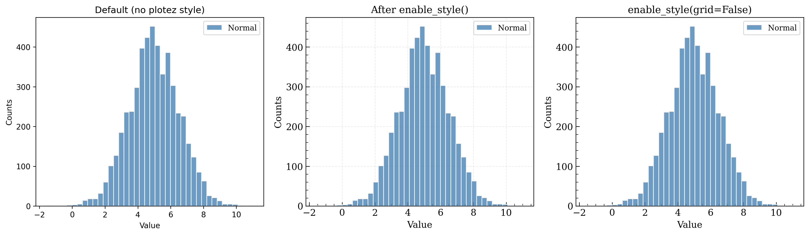

Styling
=======

By default, importing ``plotez`` does not change any of matplotlib's global ``rcParams`` — a plotting
library should not silently mutate the style of the larger project that imports it.
Complete function signatures are available in :doc:`../api`.

.. contents:: Sections
   :local:
   :depth: 1

----

Opting In at Runtime
---------------------

Call ``plotez.enable_style()`` to apply plotez's publication-ready convention (serif fonts, grid,
tick geometry) to every axes created afterward, and ``plotez.disable_style()`` to restore matplotlib's
own defaults. Pass ``grid=False`` to ``enable_style()`` to keep every other styling choice but leave
grids off. Because matplotlib snapshots settings like ``axes.grid`` and ``font.family`` onto an axes at
creation time, each panel below is created right after its corresponding style call.

.. literalinclude:: ../../examples/rtd_images/RTD_E16_style_comparison.py
   :language: python
   :lines: 3-38

----

Opting In at Import Time
--------------------------

Set the ``PLOTEZ_AUTO_STYLE`` environment variable to ``1``, ``true``, or ``yes`` before
``import plotez`` to apply the style convention automatically on import, without an explicit
``enable_style()`` call:

.. code-block:: bash

   PLOTEZ_AUTO_STYLE=1 python my_script.py

.. code-block:: python

   import os
   os.environ["PLOTEZ_AUTO_STYLE"] = "1"  # must be set before importing plotez
   import plotez

The variable is only read once, at import time; calling ``plotez.enable_style()`` or
``plotez.disable_style()`` afterward still works and takes precedence for the remainder of the process.
